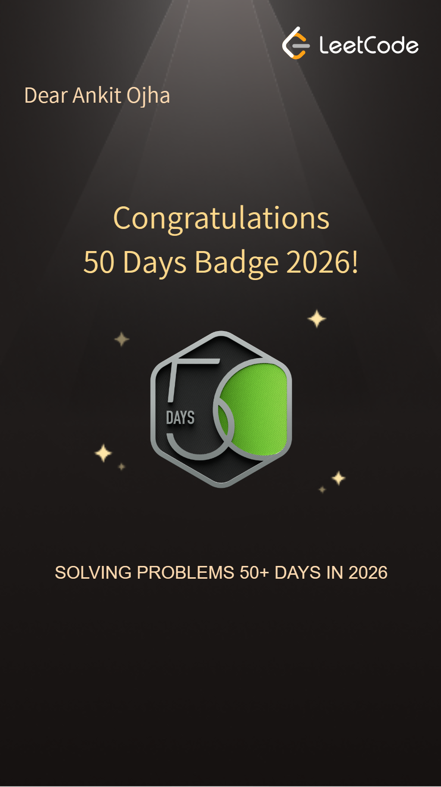
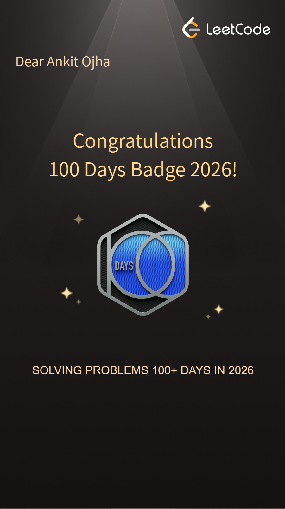

# 🚀 DSA Practice Repository

<div align="center">


</div>

---

<div align="center">

## 🏆 LeetCode Achievements

<table>
<tr>
<td align="center">
<br>
<b>🏅 50 Days Badge</b>
</td>

<td align="center">
<br>
<b>🏅 100 Days Badge</b>
</td>
</tr>
</table>

</div>

## 📖 About

Welcome to my **Data Structures & Algorithms (DSA)** practice repository.

This repository contains my daily coding practice, implementations, and problem-solving journey using **Java**.

### 🎯 Goals

- Strengthen problem-solving skills
- Master Data Structures & Algorithms
- Prepare for coding interviews
- Improve logical thinking
- Track daily progress

---

## 🛠 Tech Stack

| Technology | Usage |
|------------|--------|
| Java | Programming Language |
| VS Code | Development Environment |
| Git | Version Control |
| GitHub | Repository Hosting |

---

# 📂 Topics Covered

## ✅ Arrays

- Array Basics
- Traversal
- Input & Output
- Searching
- Array Problems

---

## ✅ Binary Search

- Binary Search Basics
- Search in Sorted Array
- Time Complexity Analysis

---

## ✅ Sorting Algorithms

### Bubble Sort
- Ascending Sort
- Descending Sort
- Optimization

### Cyclic Sort
- Missing Number Problems
- Duplicate Number Problems

### Merge Sort
- Divide and Conquer
- Recursive Merge Sort

---

## ✅ Methods

- Method Creation
- Parameters
- Return Types
- Function Reusability

---

## ✅ OOPs Concepts

### Encapsulation
### Polymorphism
### Constructors
### Static Keyword
### Final Keyword
### Classes & Objects

---

## ✅ Pattern Printing

- Star Patterns
- Number Patterns
- Pyramid Patterns
- Hollow Patterns

---

## ✅ Recursion

- Recursive Functions
- Base Condition
- Recursive Calls
- Factorial
- Fibonacci
- Pattern Problems

---

## ✅ Strings

- String Basics
- String Methods
- String Manipulation
- String Problems

---

## ✅ Time & Space Complexity

- Big O Notation
- Best Case
- Average Case
- Worst Case
- Complexity Analysis

---

## ✅ Linked List

- Creating Linked List Data Structure
- Slow and Fast Approach
- Practice Multiple Questions: LeetCode, GeeksforGeeks
- Circular Linked List
- Doubly Linked List

---

## ✅ Stacks

- LIFO Principle
- Basic Stack methods
- Linkedlist implementation of stack
- LeetCode practice
- Questions

---

## ✅ Queue

- FIFO Principle
- Basic Queue
- Linkedlist implementation of Queue
- Stack implementation of Queue
- Array implementation of Queue

---


# 📊 Learning Progress

| Topic | Status |
|--------|---------|
| Arrays | ✅ Completed |
| Binary Search | ✅ Completed |
| Bubble Sort | ✅ Completed |
| Cyclic Sort | ✅ Completed |
| Merge Sort | ✅ Completed |
| Methods | ✅ Completed |
| OOPs | ✅ Completed |
| Pattern Printing | ✅ Completed |
| Recursion | ✅ Completed |
| Strings | ✅ Completed |
| Time Complexity | ✅ Completed |
| Linked List | ✅ Completed |
| Stacks | ✅ Completed |
| Queues | ✅ Completed |
| Binary Tree | ✅ Completed |

---

# 🗺️ Upcoming Topics


- [ ] HashMap
- [ ] HashSet
- [ ] Trees
- [ ] Binary Search Tree
- [ ] Heap
- [ ] Trie
- [ ] Graph
- [ ] Dynamic Programming
- [ ] Greedy Algorithms
- [ ] Backtracking
- [ ] Algorithm Techniques

---

# 📅 Daily Practice Rule

```java
while(true){
    learn();
    code();
    improve();
}
```

---

# 📈 Repository Stats

> Consistency beats intensity.

Solve problems daily, learn continuously, and improve gradually.

---

## 🌟 Connect With Me

### Ankit Kumar Ojha

- MERN Stack Developer
- Java Developer
- DSA Enthusiast
- Future Software Engineer

---

<div align="center">

### ⭐ If you like this repository, don't forget to star it!

 Happy Coding 

</div>